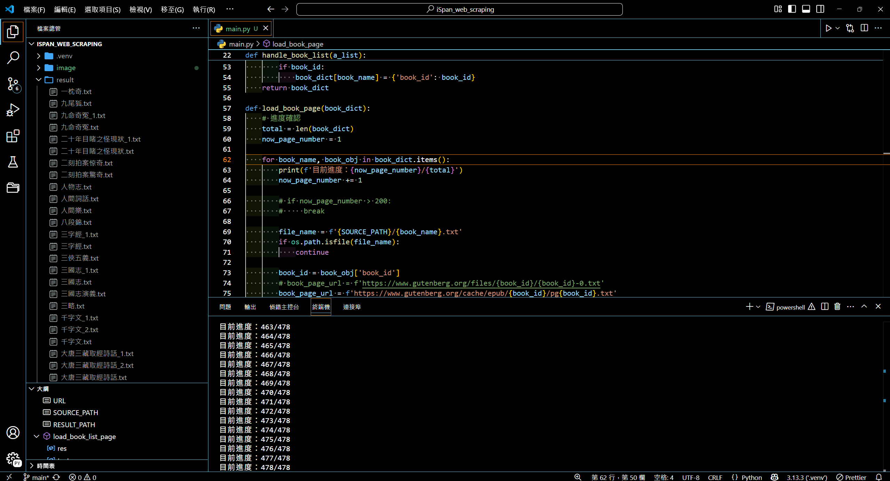
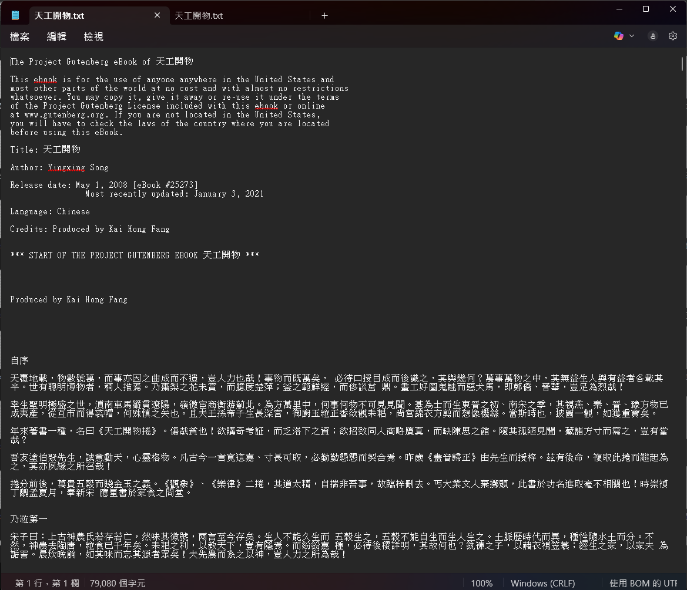
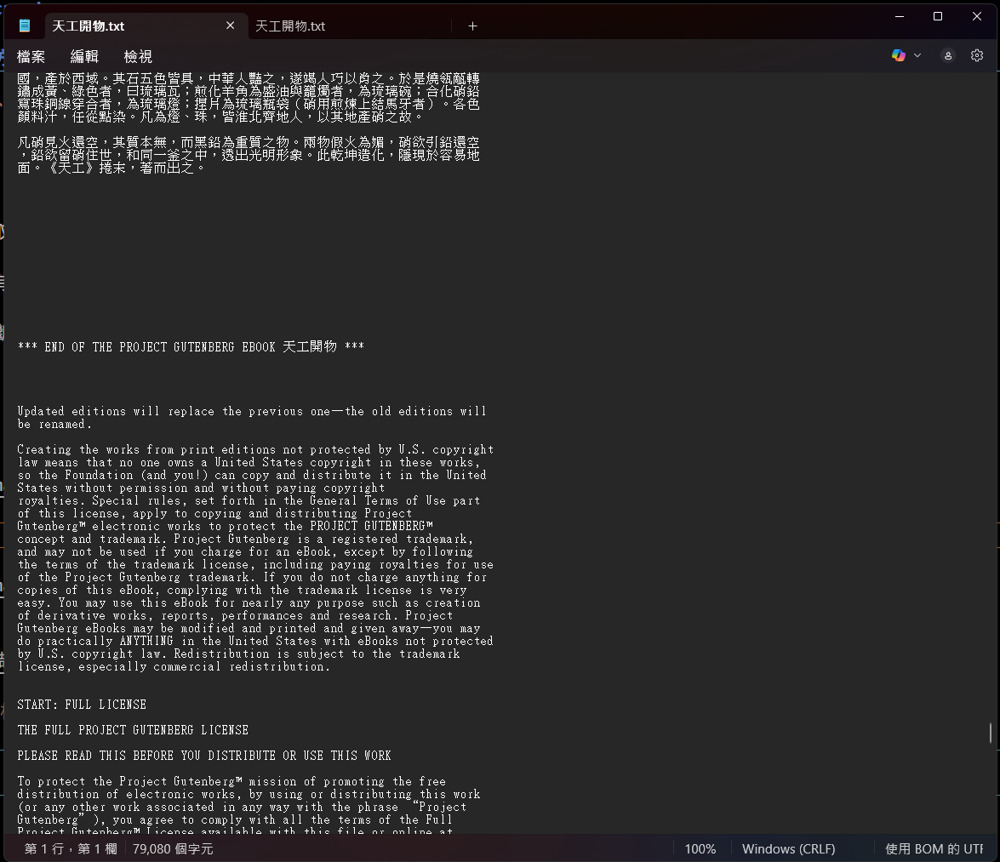
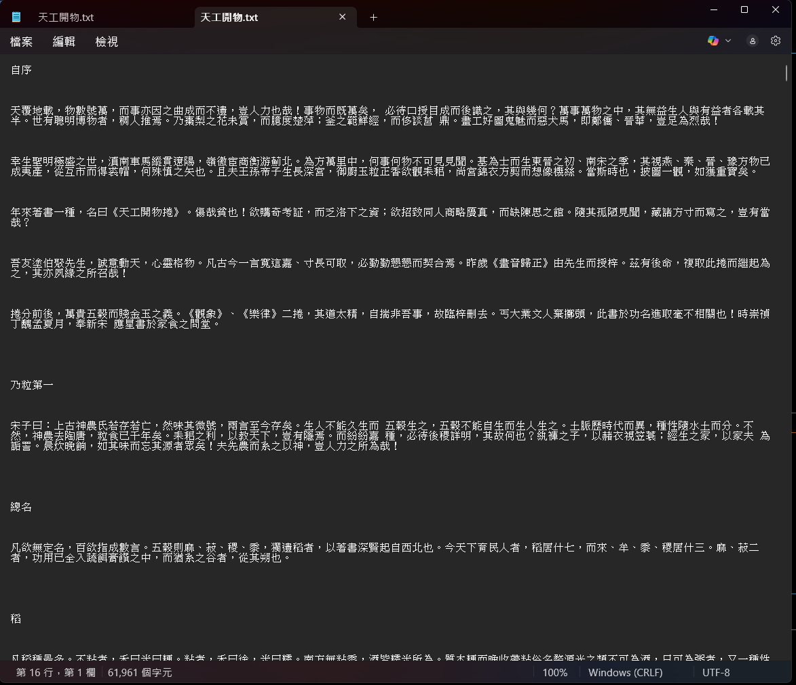
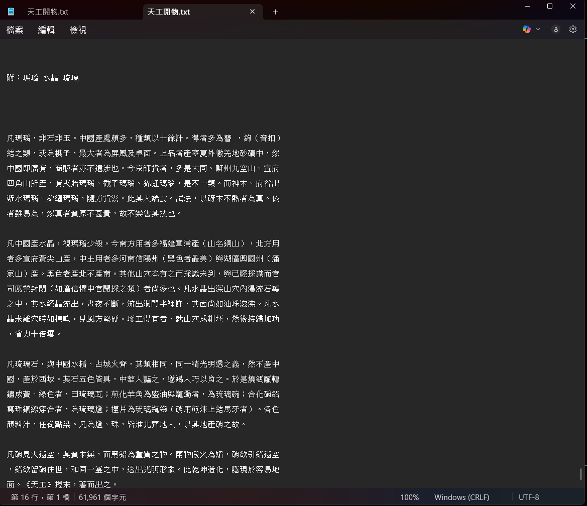

# iSpan_web_scraping

爬取中文書籍，共 478 本。

## python 版本

python version at least 3.13.3

## 安裝套件

```text
lxml==5.4.0
requests==2.32.3
beautifulsoup4==4.13.4
```

### 可透過以下方式安裝

```sh
pip install -r requirements.txt
```

## 執行

```sh
python main.py
```

## 說明

- 此程式是先爬取後解析，若爬取到一定程度時可先在`main.py` 66 67 行取消註解進行解析測試

- 當檔名重複時有加上編號

- 爬取時程式中斷，會抓取檔案名稱判斷source資料夾是否有儲存過，有的話會直接跳過爬取流程

## 成果



### 原始資料




### 處理過資料




---

## 執行過程

[youtube 爬取影片](https://youtu.be/wvoYlveXbMs)
